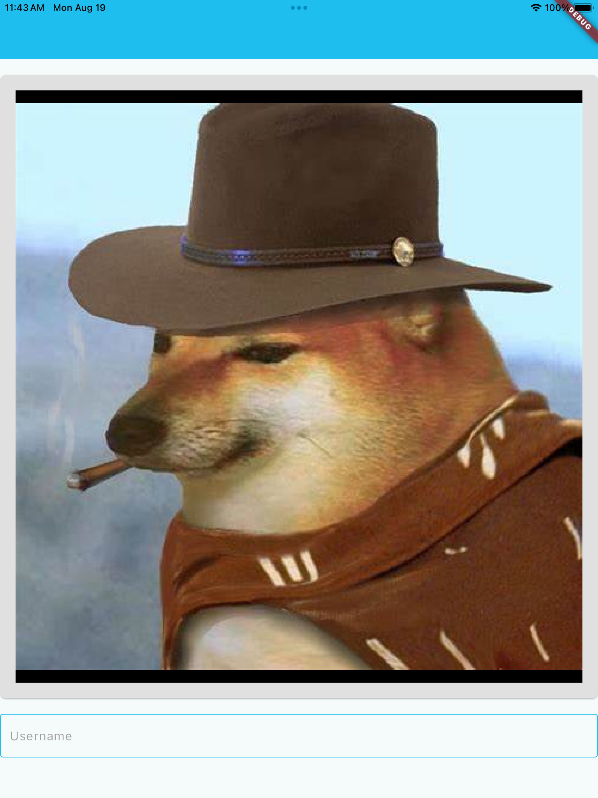
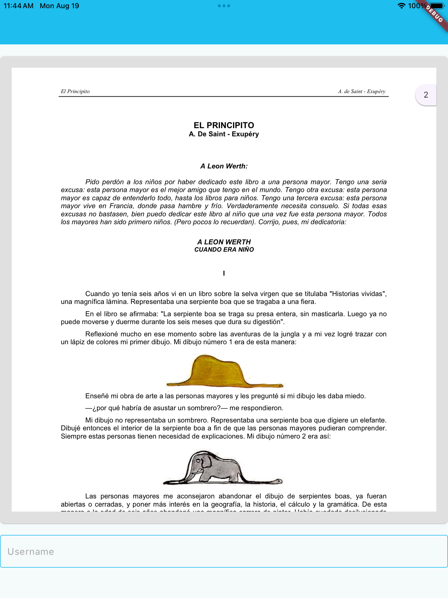
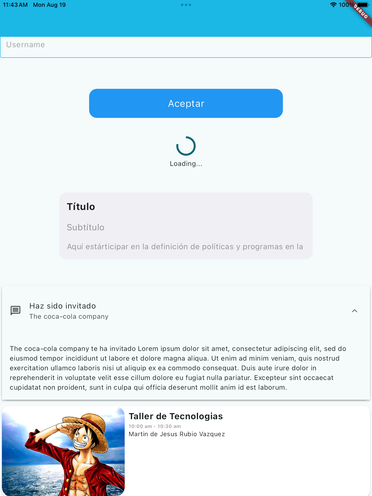
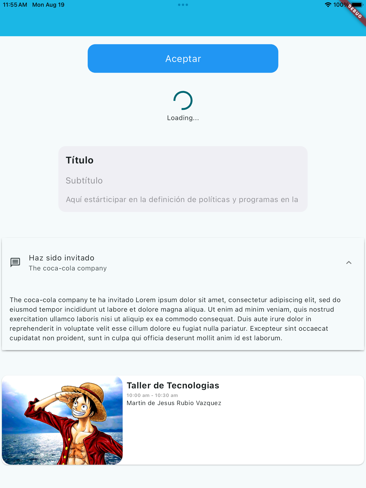

<h1>Fragua Custom Widgets v(1.0)</h1>

Paquete propiedad de <b> Farmacia Guadalajara S.A. de C.V. </b>

<b> Autor: </b> Equipo de mantenimiento de aplicaciones móviles.

## Resultados

<div align="center">
    <table border="5">
        <tr>
            <td><b>Visor de Imágenes</b><br>
                 <br>
            </td>
            <td><b>Visor de PDF</b><br>
                 <br>
            </td>
        </tr>
        <tr>
            <td><b>Componentes</b><br>
                 <br>
            </td>
            <td><b>Cards</b><br>
                 <br>
            </td>
        </tr>
    </table>
</div>

## Instalación

```dart
flutter pub get

flutter run
```

## Ejemplo

Se debe crear la carpeta `/example` en el proyecto, e incluir el siguiente código en el archivo <b>main.dart</b> de dicha carpeta.

<h2>main.dart</h2>

```dart
import 'package:flutter/material.dart';
import 'package:fragua_custom_widgets/FGWidgets/FGDocumentViewer.dart';
import 'package:fragua_custom_widgets/FGWidgets/FGCardSpeaker.dart';
import 'package:fragua_custom_widgets/FGWidgets/FGCustomButton.dart';
import 'package:fragua_custom_widgets/FGWidgets/FGLoading.dart';
import 'package:fragua_custom_widgets/FGWidgets/FGTextField.dart';
import 'package:fragua_custom_widgets/FGWidgets/FGCardView.dart';
import 'package:fragua_custom_widgets/FGWidgets/FGMensaje.dart';
import 'package:fragua_custom_widgets/utils/FGColors.dart';


void main() {
  runApp(const MyApp());
}

class MyApp extends StatelessWidget {
  const MyApp({super.key});

  @override
  Widget build(BuildContext context) {
    return MaterialApp(
      title: 'Fragua Demo',
      theme: ThemeData(
        colorScheme: ColorScheme.fromSeed(seedColor: FGColors.fgBackgroundColor),
        useMaterial3: true,
      ),
      home: const MyHomePage(title: 'Fragua Demo', numCards: 6),
    );
  }
}

class MyHomePage extends StatefulWidget {
  const MyHomePage({super.key, required this.title, numCards});

  final String title;
  final double numCards = 0;

  @override
  State<MyHomePage> createState() => _MyHomePageState();
}
  
enum CheemsPhotos { 
  cheemsVaquero, 
  cheemsDeChill
}

class _MyHomePageState extends State<MyHomePage> {

  final String filePathPDF = "assets/el_principito.pdf";
  final bool isPDF = true;

  final List<String> cheemsPhotos = [
    "assets/cheems_vaquero.jpg",
    "assets/cheems_de_chill.png"
  ];
  final CheemsPhotos numImage = CheemsPhotos.cheemsVaquero;

  @override
  Widget build(BuildContext context) {
    return Scaffold(
      appBar: AppBar(
        backgroundColor: FGColors.fgPrimaryColor,
      ),
      body: SingleChildScrollView(
        child: Column(
            mainAxisAlignment: MainAxisAlignment.center,
            children: <Widget>[
              const SizedBox(height: 20.0),
              DocumentViewer(
                size: const Size(1000, 800),
                filePath: isPDF ? filePathPDF : cheemsPhotos[numImage.index],  // Ruta de la imagen o PDF
                isPDF: isPDF,  // Cambia a true si es un PDF
                margin: const EdgeInsets.all(0.0),
              ),
              const SizedBox(height: 20.0),
              FGTextField(
                label: "Username",
                icon: Icons.person,
                error: '',
                showIcon: false,
                onChanged: (value) {
                  print('Entro onchanged:${value}');
                }),
              const SizedBox(height: 40.0),
              CustomButton(
                text: 'Aceptar',
                onPressed: () {
                  print("Presionado");
                },
                color: Colors.blue,
                colorHovered: Colors.blue,
                borderRadius: 16.0,
                textStyle: const TextStyle(
                  fontSize: 20.0,
                  color: Colors.white,
                ),
                padding: const EdgeInsets.all(16.0),
                highlightColor: Colors.lightBlue,
                width: 400,
                height: 60,
                alignment: Alignment.center,
                marginButton: const EdgeInsets.symmetric(horizontal: 0.0),
              ),
              const SizedBox(height: 40.0),
              const FGLoadingWidget(),
              const SizedBox(height: 40.0),
              Fgcardview('Título', 'Subtítulo', 'Aquí estárticipar en la definición de políticas y programas en la '),
              const SizedBox(height: 40.0),
              FGMensaje(
                title: 'Haz sido invitado',
                subTitle: 'The coca-cola company ',
                description: 'The coca-cola company te ha invitado Lorem ipsum dolor sit amet, consectetur adipiscing elit, sed do eiusmod tempor incididunt ut labore et dolore magna aliqua. Ut enim ad minim veniam, quis nostrud exercitation ullamco laboris nisi ut aliquip ex ea commodo consequat. Duis aute irure dolor in reprehenderit in voluptate velit esse cillum dolore eu fugiat nulla pariatur. Excepteur sint occaecat cupidatat non proident, sunt in culpa qui officia deserunt mollit anim id est laborum.',
                icon: Icons.message_outlined,
              ),
              const SizedBox(height: 40.0),
              Fgcardspeaker(
                urlImage: 'https://images4.alphacoders.com/102/1029798.jpg',
                title: 'Taller de Tecnologias',
                hours: '10:00 am - 10:30 am',
                name: 'Martin de Jesus Rubio Vazquez',
              ),
              const SizedBox(height: 40.0),
            ],
          ),
        ),
    );
  }
}
```
